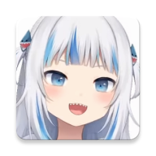
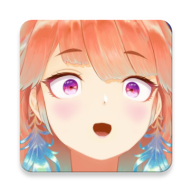
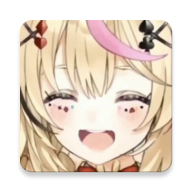
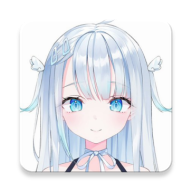
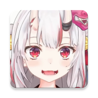
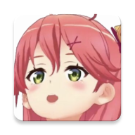
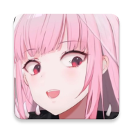
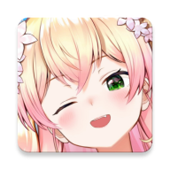
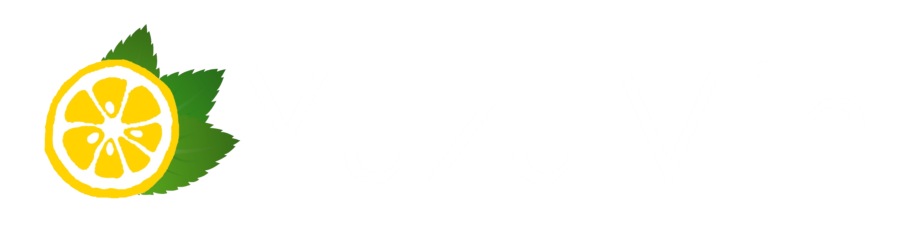

# Independent Developer YuzuMin

I'm YuzuMin, a self taught programmer, and UI/UX designer. The fields I specialize in are Android App, Web, and Software Development. I have adequate design skills to make the right decisions when designing the UI for my applications. You might be curious as to why an engineer would learn design aswell. It's because I like being a "lone wolf" and doing everything on my own. But I'm definitely open to collaborations afterall I'm an ENTJ personality type. Feel free to slide into my DMs, I love talking to people. 

  

<!--
**YuzuMin/YuzuMin** is a ✨ _special_ ✨ repository because its `README.md` (this file) appears on your GitHub profile.

  

Here are some ideas to get you started:
## Quando il gioco è finito, il re e il pedone vanno nella stessa scatola.

- 🔭 I’m currently working on ...
- 🌱 I’m currently learning ...
- 👯 I’m looking to collaborate on ...
- 🤔 I’m looking for help with ...
- 💬 Ask me about ...
- 📫 How to reach me: ...
- 😄 Pronouns: ...
- ⚡ Fun fact: ...
-->
